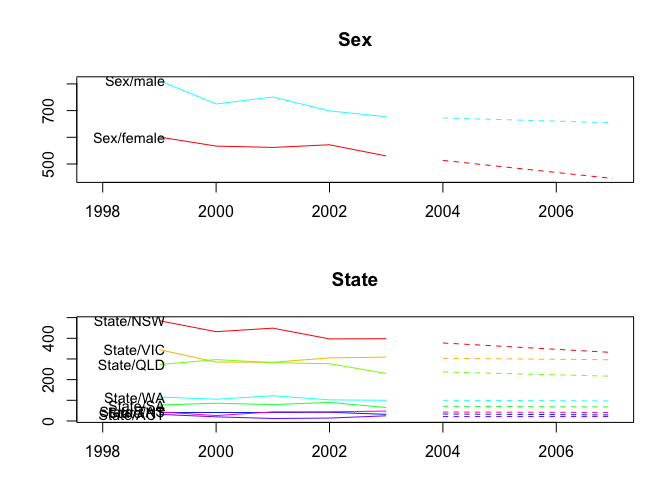

<!-- README.md is generated from README.Rmd. Please edit that file -->
hts
===

[](https://travis-ci.org/earowang/hts) [](https://codecov.io/gh/earowang/hts) [](https://cran.r-project.org/package=hts) [](https://cran.r-project.org/package=hts) [](https://github.com/earowang/hts/pulls)

The R package *hts* presents functions to create, plot and forecast hierarchical and grouped time series.

Installation
------------

You can install the **stable** version on [R CRAN](https://cran.r-project.org/package=hts).

``` r
install.packages('hts', dependencies = TRUE)
```

You can also install the **development** version from [Github](https://github.com/robjhyndman/gts)

``` r
# install.packages("devtools")
devtools::install_github("earowang/hts")
```

Usage
-----

### Example 1: hierarchical time series

``` r
library(hts)
#> Loading required package: forecast

# hts example 1
print(htseg1)
#> $bts
#> Time Series:
#> Start = 1992 
#> End = 2001 
#> Frequency = 1 
#>            AA        AB       AC       BA       BB
#> 1992 7.862669  9.267647 10.08102 10.49276 11.04398
#> 1993 8.340355  9.416544 10.08193 10.51712 11.12452
#> 1994 8.549132  9.479022 10.11719 10.54013 11.24691
#> 1995 8.597699  9.532376 10.14705 10.61220 11.35138
#> 1996 8.770196  9.547591 10.16021 10.64932 11.48114
#> 1997 8.837793  9.555664 10.17101 10.70736 11.57668
#> 1998 8.893267  9.730347 10.28392 10.86323 11.93846
#> 1999 8.933993  9.797294 10.29026 10.92463 11.99712
#> 2000 9.133653  9.921262 10.34817 11.00622 12.16865
#> 2001 9.152636 10.022783 10.46706 11.03531 12.53717
#> 
#> $nodes
#> $nodes$`Level 0`
#> [1] 2
#> 
#> $nodes$`Level 1`
#> [1] 3 2
#> 
#> 
#> $labels
#> $labels$`Level 0`
#> [1] "Total"
#> 
#> $labels$`Level 1`
#> [1] "A" "B"
#> 
#> $labels$`Level 2`
#> [1] "AA" "AB" "AC" "BA" "BB"
#> 
#> 
#> attr(,"class")
#> [1] "gts" "hts"
summary(htseg1)
#>        Length Class  Mode   
#> bts    50     mts    numeric
#> nodes   2     -none- list   
#> labels  3     -none- list
aggts(htseg1)
#> Time Series:
#> Start = 1992 
#> End = 2001 
#> Frequency = 1 
#>         Total        A        B       AA        AB       AC       BA
#> 1992 48.74808 27.21134 21.53674 7.862669  9.267647 10.08102 10.49276
#> 1993 49.48047 27.83883 21.64164 8.340355  9.416544 10.08193 10.51712
#> 1994 49.93238 28.14535 21.78704 8.549132  9.479022 10.11719 10.54013
#> 1995 50.24070 28.27712 21.96358 8.597699  9.532376 10.14705 10.61220
#> 1996 50.60846 28.47800 22.13046 8.770196  9.547591 10.16021 10.64932
#> 1997 50.84851 28.56447 22.28404 8.837793  9.555664 10.17101 10.70736
#> 1998 51.70922 28.90753 22.80169 8.893267  9.730347 10.28392 10.86323
#> 1999 51.94330 29.02155 22.92175 8.933993  9.797294 10.29026 10.92463
#> 2000 52.57796 29.40308 23.17488 9.133653  9.921262 10.34817 11.00622
#> 2001 53.21496 29.64248 23.57248 9.152636 10.022783 10.46706 11.03531
#>            BB
#> 1992 11.04398
#> 1993 11.12452
#> 1994 11.24691
#> 1995 11.35138
#> 1996 11.48114
#> 1997 11.57668
#> 1998 11.93846
#> 1999 11.99712
#> 2000 12.16865
#> 2001 12.53717
aggts(htseg1, levels = 1)
#> Time Series:
#> Start = 1992 
#> End = 2001 
#> Frequency = 1 
#>             A        B
#> 1992 27.21134 21.53674
#> 1993 27.83883 21.64164
#> 1994 28.14535 21.78704
#> 1995 28.27712 21.96358
#> 1996 28.47800 22.13046
#> 1997 28.56447 22.28404
#> 1998 28.90753 22.80169
#> 1999 29.02155 22.92175
#> 2000 29.40308 23.17488
#> 2001 29.64248 23.57248
aggts(htseg1, levels = c(0, 2))
#> Time Series:
#> Start = 1992 
#> End = 2001 
#> Frequency = 1 
#>         Total       AA        AB       AC       BA       BB
#> 1992 48.74808 7.862669  9.267647 10.08102 10.49276 11.04398
#> 1993 49.48047 8.340355  9.416544 10.08193 10.51712 11.12452
#> 1994 49.93238 8.549132  9.479022 10.11719 10.54013 11.24691
#> 1995 50.24070 8.597699  9.532376 10.14705 10.61220 11.35138
#> 1996 50.60846 8.770196  9.547591 10.16021 10.64932 11.48114
#> 1997 50.84851 8.837793  9.555664 10.17101 10.70736 11.57668
#> 1998 51.70922 8.893267  9.730347 10.28392 10.86323 11.93846
#> 1999 51.94330 8.933993  9.797294 10.29026 10.92463 11.99712
#> 2000 52.57796 9.133653  9.921262 10.34817 11.00622 12.16865
#> 2001 53.21496 9.152636 10.022783 10.46706 11.03531 12.53717
plot(htseg1, levels = 1)
```


``` r
smatrix(htseg1)  # Return the dense mode
#>      [,1] [,2] [,3] [,4] [,5]
#> [1,]    1    1    1    1    1
#> [2,]    1    1    1    0    0
#> [3,]    0    0    0    1    1
#> [4,]    1    0    0    0    0
#> [5,]    0    1    0    0    0
#> [6,]    0    0    1    0    0
#> [7,]    0    0    0    1    0
#> [8,]    0    0    0    0    1

# Forecasts
fcasts1.bu <- forecast(
  htseg1, h = 4, method = "bu", fmethod = "ets", parallel = TRUE
)
aggts(fcasts1.bu)
#> Time Series:
#> Start = 2002 
#> End = 2005 
#> Frequency = 1 
#>        Total        A        B       AA       AB       AC       BA
#> 2002 53.2149 29.64246 23.57244 9.152634 10.02277 10.46705 11.03531
#> 2003 53.2149 29.64246 23.57244 9.152634 10.02277 10.46705 11.03531
#> 2004 53.2149 29.64246 23.57244 9.152634 10.02277 10.46705 11.03531
#> 2005 53.2149 29.64246 23.57244 9.152634 10.02277 10.46705 11.03531
#>            BB
#> 2002 12.53713
#> 2003 12.53713
#> 2004 12.53713
#> 2005 12.53713
summary(fcasts1.bu)
#>         Length Class  Mode     
#> bts     20     mts    numeric  
#> histy   50     mts    numeric  
#> labels   3     -none- list     
#> method   1     -none- character
#> fmethod  1     -none- character
#> nodes    2     -none- list
fcasts1.td <- forecast(
  htseg1, h = 4, method = "tdfp", fmethod = "arima", keep.fitted = TRUE
)
summary(fcasts1.td)  # When keep.fitted = TRUE, return in-sample accuracy
#>         Length Class  Mode     
#> bts     20     mts    numeric  
#> histy   50     mts    numeric  
#> labels   3     -none- list     
#> method   1     -none- character
#> fmethod  1     -none- character
#> fitted  50     mts    numeric  
#> nodes    2     -none- list
fcasts1.comb <- forecast(
  htseg1, h = 4, method = "comb", fmethod = "ets", keep.fitted = TRUE
)
aggts(fcasts1.comb)
#> Time Series:
#> Start = 2002 
#> End = 2005 
#> Frequency = 1 
#>         Total        A        B       AA       AB       AC       BA
#> 2002 53.52186 29.77604 23.74583 9.226494 10.06002 10.48952 11.08129
#> 2003 53.95209 29.96953 23.98255 9.333485 10.11398 10.52207 11.14408
#> 2004 54.38231 30.16303 24.21928 9.440475 10.16794 10.55461 11.20687
#> 2005 54.81253 30.35652 24.45600 9.547466 10.22190 10.58716 11.26965
#>            BB
#> 2002 12.66453
#> 2003 12.83847
#> 2004 13.01241
#> 2005 13.18635
print(fcasts1.comb)  
#> $bts
#> Time Series:
#> Start = 2002 
#> End = 2005 
#> Frequency = 1 
#>            AA       AB       AC       BA       BB
#> 2002 9.226494 10.06002 10.48952 11.08129 12.66453
#> 2003 9.333485 10.11398 10.52207 11.14408 12.83847
#> 2004 9.440475 10.16794 10.55461 11.20687 13.01241
#> 2005 9.547466 10.22190 10.58716 11.26965 13.18635
#> 
#> $histy
#> Time Series:
#> Start = 1992 
#> End = 2001 
#> Frequency = 1 
#>            AA        AB       AC       BA       BB
#> 1992 7.862669  9.267647 10.08102 10.49276 11.04398
#> 1993 8.340355  9.416544 10.08193 10.51712 11.12452
#> 1994 8.549132  9.479022 10.11719 10.54013 11.24691
#> 1995 8.597699  9.532376 10.14705 10.61220 11.35138
#> 1996 8.770196  9.547591 10.16021 10.64932 11.48114
#> 1997 8.837793  9.555664 10.17101 10.70736 11.57668
#> 1998 8.893267  9.730347 10.28392 10.86323 11.93846
#> 1999 8.933993  9.797294 10.29026 10.92463 11.99712
#> 2000 9.133653  9.921262 10.34817 11.00622 12.16865
#> 2001 9.152636 10.022783 10.46706 11.03531 12.53717
#> 
#> $labels
#> $labels$`Level 0`
#> [1] "Total"
#> 
#> $labels$`Level 1`
#> [1] "A" "B"
#> 
#> $labels$`Level 2`
#> [1] "AA" "AB" "AC" "BA" "BB"
#> 
#> 
#> $method
#> [1] "comb"
#> 
#> $fmethod
#> [1] "ets"
#> 
#> $fitted
#> Time Series:
#> Start = 1992 
#> End = 2001 
#> Frequency = 1 
#>            AA       AB       AC       BA       BB
#> 1992 7.961007 9.316365 10.11063 10.47954 11.00555
#> 1993 8.086162 9.380361 10.14901 10.51746 11.11241
#> 1994 8.406427 9.449875 10.10204 10.54646 11.20581
#> 1995 8.596873 9.503103 10.13172 10.57413 11.34110
#> 1996 8.699505 9.583717 10.17802 10.65257 11.46323
#> 1997 8.894878 9.610479 10.19815 10.69791 11.61576
#> 1998 9.038816 9.657048 10.23216 10.76628 11.73992
#> 1999 9.006894 9.787638 10.31848 10.89522 12.02710
#> 2000 9.098355 9.880182 10.34026 10.99247 12.18507
#> 2001 9.229538 9.969617 10.37733 11.07017 12.34581
#> 
#> $nodes
#> $nodes$`Level 0`
#> [1] 2
#> 
#> $nodes$`Level 1`
#> [1] 3 2
#> 
#> 
#> attr(,"class")
#> [1] "gts" "hts"
plot(fcasts1.comb, levels = 2)
```


``` r
plot(fcasts1.comb, include = 5, levels = c(1, 2))
```


### Example 2: hierarchical time series

``` r
# hts example 2
data <- window(htseg2, start = 1992, end = 2002)
test <- window(htseg2, start = 2003)
fcasts2.mo <- forecast(
  data, h = 5, method = "mo", fmethod = "ets", level = 1,
  keep.fitted = TRUE, keep.resid = TRUE
)
accuracy.gts(fcasts2.mo, test)
#>            Total          A          B        A10         A20         B30
#> ME    -0.1794783 -0.2486428 0.06916451 -0.1954860 -0.05315684 -0.02399186
#> RMSE   0.1818643  0.2732218 0.13585344  0.2180641  0.05572214  0.03144802
#> MAE    0.1794783  0.2486428 0.11251209  0.1954860  0.05315684  0.02399186
#> MAPE  11.1268019  8.4004312 2.27814495  7.5371465 14.49009308  1.69936058
#> MPE  -11.1268019  8.4004312 1.30221674  7.5371465 14.49009308 -1.69936058
#> MASE   0.5663497  1.3950200 0.81137939  1.2966219  1.93505737  0.52639468
#>             B40        A10A       A10B         A10C        A20A
#> ME   0.09315637 -0.03774880 -0.1649411  0.007203920 -0.04105604
#> RMSE 0.16498366  0.05205754  0.1779641  0.012753680  0.04696434
#> MAE  0.13636607  0.03873088  0.1649411  0.009838328  0.04105604
#> MAPE 3.85101876  3.11436103 20.5656022  1.774154141 13.39804861
#> MPE  2.45900161  3.04078646 20.5656022 -1.351777719 13.39804861
#> MASE 1.46488456  0.36661690  5.1038016  0.768361455  3.23432001
#>             A20B         B30A       B30B       B30C       B40A      B40B
#> ME   -0.01210080  -0.05065830 0.01324339 0.01342306 -0.0495926 0.1427490
#> RMSE  0.01432307   0.05944454 0.01485743 0.01599316  0.0728362 0.2349335
#> MAE   0.01228684   0.05065830 0.01324339 0.01342306  0.0495926 0.1800119
#> MAPE 15.88898042  16.89941739 2.89472660 2.07537753  3.6008092 8.1543683
#> MPE  15.22048749 -16.89941739 2.89472660 2.07537753 -3.6008092 6.1053561
#> MASE  0.83150955   2.07454397 1.47284424 1.10323688  0.9554614 4.3707453
accuracy.gts(fcasts2.mo, test, levels = 1)
#>               A          B
#> ME   -0.2486428 0.06916451
#> RMSE  0.2732218 0.13585344
#> MAE   0.2486428 0.11251209
#> MAPE  8.4004312 2.27814495
#> MPE   8.4004312 1.30221674
#> MASE  1.3950200 0.81137939
fcasts2.td <- forecast(
  data, h = 5, method = "tdgsa", fmethod = "ets", 
  keep.fitted = TRUE, keep.resid = TRUE
)
summary(fcasts2.td)
#>           Length Class  Mode     
#> bts        50    mts    numeric  
#> histy     110    mts    numeric  
#> labels      4    -none- list     
#> method      1    -none- character
#> fmethod     1    -none- character
#> fitted    110    mts    numeric  
#> residuals 110    mts    numeric  
#> nodes       3    -none- list
plot(fcasts2.td, include = 5)
```


``` r
plot(fcasts2.td, include = 5, levels = c(0, 2))
```


### Example 3: grouped time series

``` r
# gts example
plot(infantgts, levels = 1)
```


``` r

fcasts3.comb <- forecast(infantgts, h = 4, method = "comb", fmethod = "ets")
aggts(fcasts3.comb, levels = 1)
#> Time Series:
#> Start = 2004 
#> End = 2007 
#> Frequency = 1 
#>      Sex/female Sex/male
#> 2004   513.5419 672.7095
#> 2005   490.9157 666.5980
#> 2006   468.2894 660.4866
#> 2007   445.6631 654.3751
aggts(fcasts3.comb, levels = 1, forecasts = FALSE)
#> Time Series:
#> Start = 1933 
#> End = 2003 
#> Frequency = 1 
#>      Sex/female Sex/male
#> 1933       1924     2502
#> 1934       2097     2698
#> 1935       1963     2538
#> 1936       2145     2668
#> 1937       2007     2565
#> 1938       1942     2685
#> 1939       2014     2712
#> 1940       2131     2766
#> 1941       2344     3023
#> 1942       2339     3096
#> 1943       2387     3071
#> 1944       2091     2728
#> 1945       2056     2685
#> 1946       2221     2922
#> 1947       2254     2977
#> 1948       2121     2857
#> 1949       1997     2624
#> 1950       2010     2662
#> 1951       2161     2749
#> 1952       2049     2774
#> 1953       2081     2662
#> 1954       1938     2608
#> 1955       1946     2625
#> 1956       2047     2583
#> 1957       2058     2693
#> 1958       1996     2590
#> 1959       2121     2794
#> 1960       2015     2652
#> 1961       2010     2690
#> 1962       2070     2791
#> 1963       2016     2636
#> 1964       1895     2508
#> 1965       1767     2357
#> 1966       1737     2328
#> 1967       1784     2421
#> 1968       1841     2452
#> 1969       1923     2584
#> 1970       1902     2718
#> 1971       2125     2684
#> 1972       1888     2577
#> 1973       1732     2356
#> 1974       1648     2326
#> 1975       1389     1952
#> 1976       1391     1770
#> 1977       1205     1629
#> 1978       1157     1575
#> 1979       1116     1441
#> 1980       1055     1383
#> 1981       1011     1354
#> 1982       1060     1425
#> 1983       1047     1302
#> 1984        925     1259
#> 1985       1075     1398
#> 1986        918     1244
#> 1987        896     1235
#> 1988        916     1227
#> 1989        882     1136
#> 1990        926     1223
#> 1991        802     1049
#> 1992        775     1073
#> 1993        680      918
#> 1994        658      866
#> 1995        660      806
#> 1996        624      843
#> 1997        608      744
#> 1998        555      706
#> 1999        601      812
#> 2000        567      725
#> 2001        562      751
#> 2002        572      699
#> 2003        530      677
plot(fcasts3.comb)
```


``` r
plot(fcasts3.comb, include = 5, levels = c(1, 2))
```



``` r

fcasts3.combsd <- forecast(
  infantgts, h = 4, method = "comb", fmethod = "ets",
  weights = "sd", keep.fitted = TRUE
)
aggts(fcasts3.combsd, levels = 1)
#> Time Series:
#> Start = 2004 
#> End = 2007 
#> Frequency = 1 
#>      Sex/female Sex/male
#> 2004   513.5419 672.7095
#> 2005   490.9157 666.5980
#> 2006   468.2894 660.4866
#> 2007   445.6631 654.3751
summary(fcasts3.combsd)
#>         Length Class   Mode     
#> bts       64   mts     numeric  
#> histy   1136   mts     numeric  
#> labels     2   -none-  list     
#> method     1   -none-  character
#> fmethod    1   -none-  character
#> fitted  1136   mts     numeric  
#> groups    64   gmatrix numeric

fcasts3.combn <- forecast(
  infantgts, h = 4, method = "comb", fmethod = "ets",
  weights = "nseries", keep.resid = TRUE
)
aggts(fcasts3.combn, levels = 3)
#> Time Series:
#> Start = 2004 
#> End = 2007 
#> Frequency = 1 
#>      NSW female VIC female QLD female SA female WA female NT female
#> 2004   170.1027   121.2634  103.75624  35.67006  46.72033 12.049177
#> 2005   159.6834   120.4511   98.79675  34.85778  45.90805 10.439765
#> 2006   149.2640   119.6388   93.83726  34.04550  45.09577  8.830352
#> 2007   138.8447   118.8266   88.87778  33.23322  44.28349  7.220939
#>      ACT female TAS female NSW male VIC male QLD male  SA male  WA male
#> 2004   6.060038   20.78827 211.1664 184.2918 134.3276 35.09971 53.21625
#> 2005   5.107381   19.97599 208.4218 184.0622 133.0403 34.87011 52.98665
#> 2006   4.154725   19.16371 205.6772 183.8326 131.7530 34.64051 52.75705
#> 2007   3.202069   18.35143 202.9326 183.6030 130.4657 34.41091 52.52745
#>       NT male ACT male TAS male
#> 2004 21.00825 13.60149 21.74516
#> 2005 20.79164 13.79302 21.51556
#> 2006 20.57504 13.98456 21.28596
#> 2007 20.35843 14.17609 21.05636
```

License
-------

This package is free and open source software, licensed under GPL (&gt;= 2).
