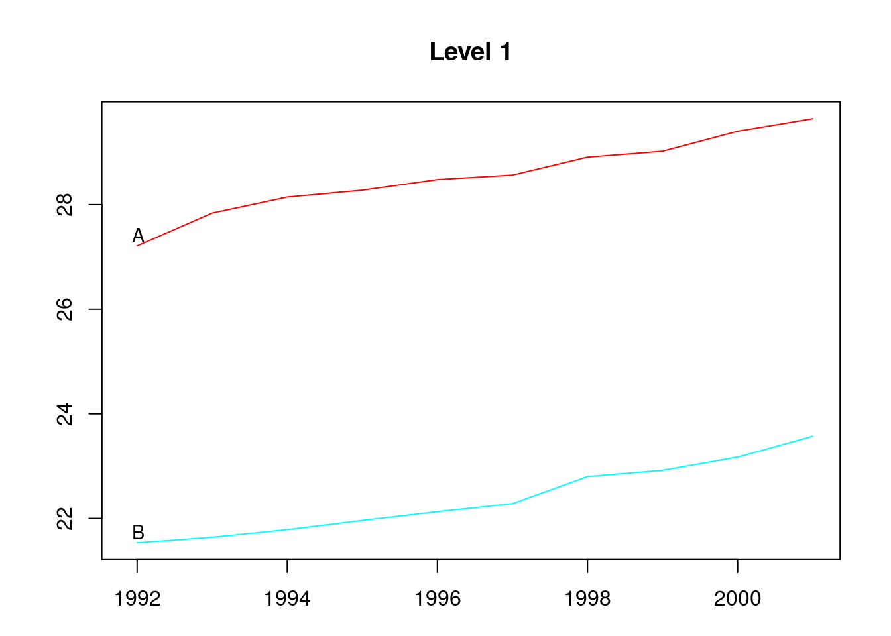
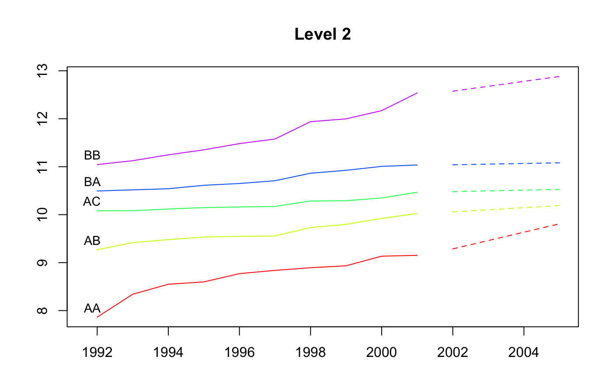
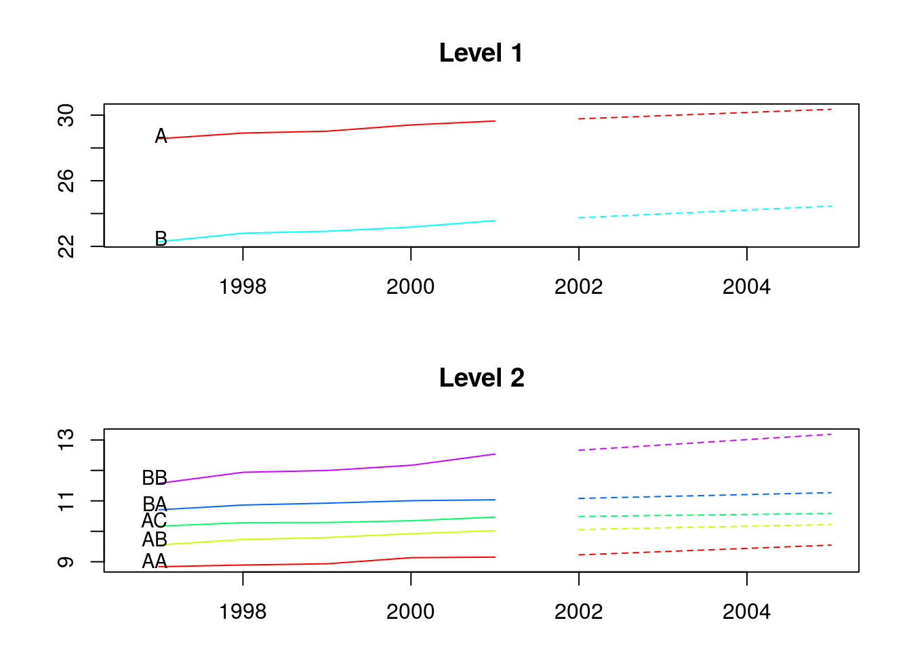
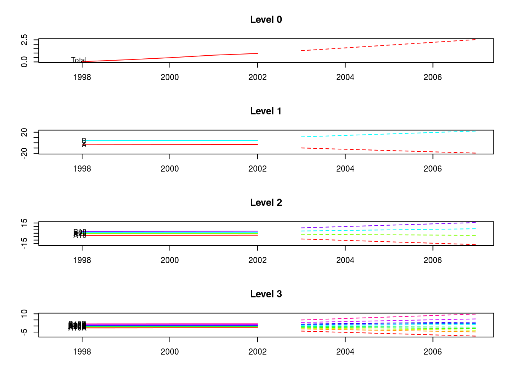
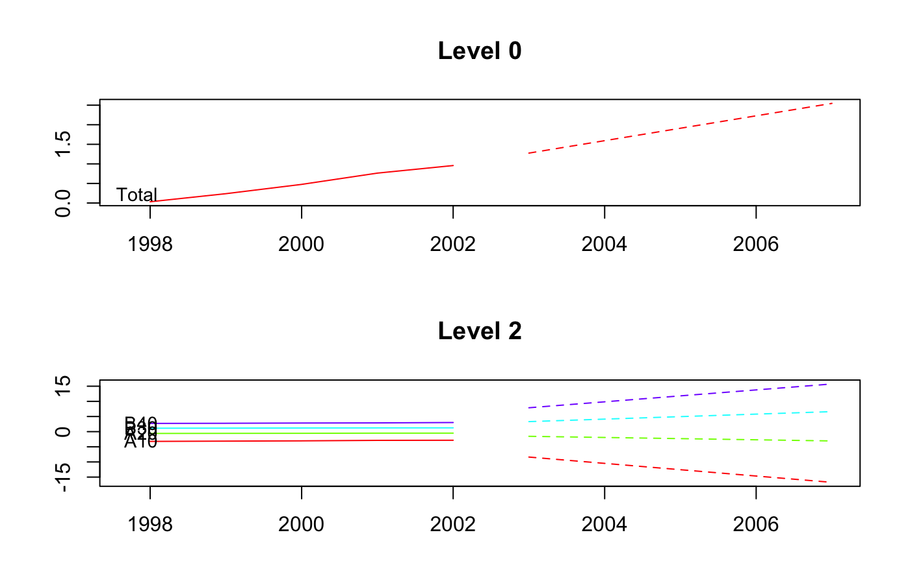
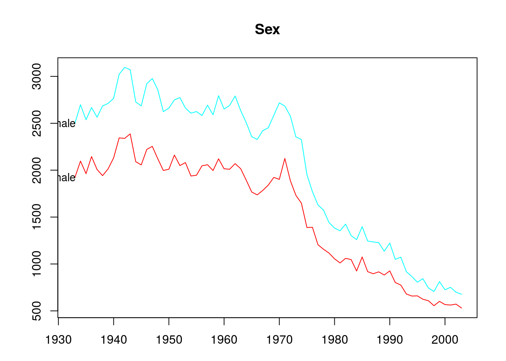
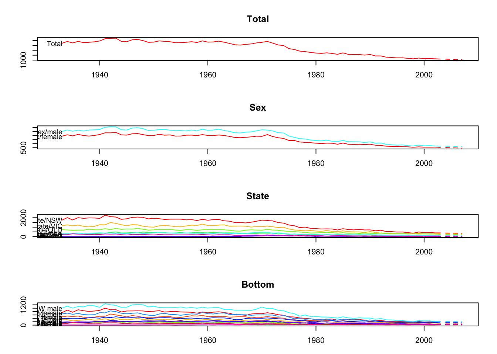
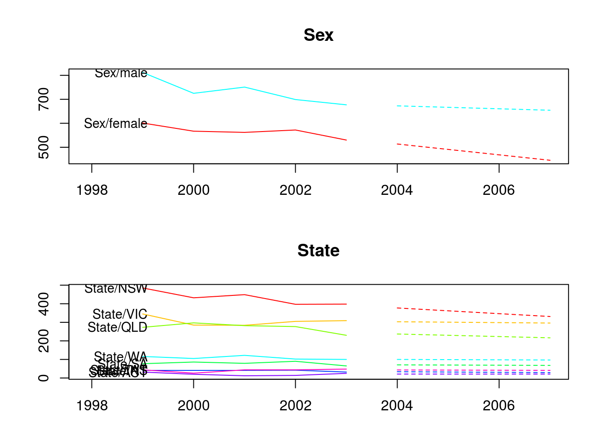

<!-- README.md is generated from README.Rmd. Please edit that file -->

# hts

[](https://travis-ci.org/earowang/hts)
[](https://codecov.io/gh/earowang/hts)
[](https://cran.r-project.org/package=hts)
[](https://cran.r-project.org/package=hts)

The R package *hts* presents functions to create, plot and forecast
hierarchical and grouped time series.

## Installation

You can install the **stable** version on [R
CRAN](https://cran.r-project.org/package=hts).

``` r
install.packages('hts', dependencies = TRUE)
```

You can also install the **development** version from
[Github](https://github.com/robjhyndman/gts)

``` r
# install.packages("devtools")
devtools::install_github("earowang/hts")
```

## Usage

### Example 1: hierarchical time series

``` r
library(hts)
#> Loading required package: forecast

# hts example 1
print(htseg1)
#> Hierarchical Time Series 
#> 3 Levels 
#> Number of nodes at each level: 1 2 5 
#> Total number of series: 8 
#> Number of observations per series: 10 
#> Top level series: 
#> Time Series:
#> Start = 1992 
#> End = 2001 
#> Frequency = 1 
#>  [1] 48.74808 49.48047 49.93238 50.24070 50.60846 50.84851 51.70922
#>  [8] 51.94330 52.57796 53.21496
summary(htseg1)
#> Hierarchical Time Series 
#> 3 Levels 
#> Number of nodes at each level: 1 2 5 
#> Total number of series: 8 
#> Number of observations per series: 10 
#> Top level series: 
#> Time Series:
#> Start = 1992 
#> End = 2001 
#> Frequency = 1 
#>  [1] 48.74808 49.48047 49.93238 50.24070 50.60846 50.84851 51.70922
#>  [8] 51.94330 52.57796 53.21496
#> 
#> Labels: 
#> [1] "Level 0" "Level 1" "Level 2"
aggts1 <- aggts(htseg1)
aggts2 <- aggts(htseg1, levels = 1)
aggts3 <- aggts(htseg1, levels = c(0, 2))
plot(htseg1, levels = 1)
```

<!-- -->

``` r
smatrix(htseg1)  # Return the dense mode
#>      [,1] [,2] [,3] [,4] [,5]
#> [1,]    1    1    1    1    1
#> [2,]    1    1    1    0    0
#> [3,]    0    0    0    1    1
#> [4,]    1    0    0    0    0
#> [5,]    0    1    0    0    0
#> [6,]    0    0    1    0    0
#> [7,]    0    0    0    1    0
#> [8,]    0    0    0    0    1

# Forecasts
fcasts1.bu <- forecast(
  htseg1, h = 4, method = "bu", fmethod = "ets", parallel = TRUE
)
aggts4 <- aggts(fcasts1.bu)
summary(fcasts1.bu)
#> Hierarchical Time Series 
#> 3 Levels 
#> Number of nodes at each level: 1 2 5 
#> Total number of series: 8 
#> Number of observations in each historical series: 10 
#> Number of forecasts per series: 4 
#> Top level series of forecasts: 
#> Time Series:
#> Start = 2002 
#> End = 2005 
#> Frequency = 1 
#> [1] 53.2149 53.2149 53.2149 53.2149
#> 
#> Method: Bottom-up forecasts 
#> Forecast method: ETS
fcasts1.td <- forecast(
  htseg1, h = 4, method = "tdfp", fmethod = "arima", keep.fitted = TRUE
)
summary(fcasts1.td)  # When keep.fitted = TRUE, return in-sample accuracy
#> Hierarchical Time Series 
#> 3 Levels 
#> Number of nodes at each level: 1 2 5 
#> Total number of series: 8 
#> Number of observations in each historical series: 10 
#> Number of forecasts per series: 4 
#> Top level series of forecasts: 
#> Time Series:
#> Start = 2002 
#> End = 2005 
#> Frequency = 1 
#> [1] 53.71128 54.20760 54.70392 55.20024
#> 
#> Method: Top-down forecasts using forecasts proportions 
#> Forecast method: Arima 
#> In-sample error measures at the bottom level: 
#>                AA           AB          AC          BA           BB
#> ME   0.0007719336 0.0009183738 0.001003812 0.001043247  0.001087807
#> RMSE 0.1298400018 0.0515879830 0.040306867 0.037462277  0.105015065
#> MAE  0.0978321731 0.0436089571 0.033210387 0.027003846  0.081906948
#> MAPE 1.1275970221 0.4534439625 0.323535559 0.251066115  0.691364891
#> MPE  0.0367879336 0.0069220593 0.006785872 0.007787895 -0.011087494
#> MASE 0.6825678136 0.5197483057 0.774250880 0.447950006  0.493684443
fcasts1.comb <- forecast(
  htseg1, h = 4, method = "comb", fmethod = "ets", keep.fitted = TRUE
)
aggts4 <- aggts(fcasts1.comb)
plot(fcasts1.comb, levels = 2)
```

<!-- -->

``` r
plot(fcasts1.comb, include = 5, levels = c(1, 2))
```

<!-- -->

### Example 2: hierarchical time series

``` r
# hts example 2
data <- window(htseg2, start = 1992, end = 2002)
test <- window(htseg2, start = 2003)
fcasts2.mo <- forecast(
  data, h = 5, method = "mo", fmethod = "ets", level = 1,
  keep.fitted = TRUE, keep.resid = TRUE
)
accuracy.gts(fcasts2.mo, test)
#>            Total          A          B        A10         A20         B30
#> ME    -0.1794783 -0.2486428 0.06916451 -0.1954860 -0.05315684 -0.02399186
#> RMSE   0.1818643  0.2732218 0.13585344  0.2180641  0.05572214  0.03144802
#> MAE    0.1794783  0.2486428 0.11251209  0.1954860  0.05315684  0.02399186
#> MAPE  11.1268019  8.4004312 2.27814495  7.5371465 14.49009308  1.69936058
#> MPE  -11.1268019  8.4004312 1.30221674  7.5371465 14.49009308 -1.69936058
#> MASE   0.5663497  1.3950200 0.81137939  1.2966219  1.93505737  0.52639468
#>             B40        A10A       A10B         A10C        A20A
#> ME   0.09315637 -0.03774880 -0.1649411  0.007203920 -0.04105604
#> RMSE 0.16498366  0.05205754  0.1779641  0.012753680  0.04696434
#> MAE  0.13636607  0.03873088  0.1649411  0.009838328  0.04105604
#> MAPE 3.85101876  3.11436103 20.5656022  1.774154141 13.39804861
#> MPE  2.45900161  3.04078646 20.5656022 -1.351777719 13.39804861
#> MASE 1.46488456  0.36661690  5.1038016  0.768361455  3.23432001
#>             A20B         B30A       B30B       B30C       B40A      B40B
#> ME   -0.01210080  -0.05065830 0.01324339 0.01342306 -0.0495926 0.1427490
#> RMSE  0.01432307   0.05944454 0.01485743 0.01599316  0.0728362 0.2349335
#> MAE   0.01228684   0.05065830 0.01324339 0.01342306  0.0495926 0.1800119
#> MAPE 15.88898042  16.89941739 2.89472660 2.07537753  3.6008092 8.1543683
#> MPE  15.22048749 -16.89941739 2.89472660 2.07537753 -3.6008092 6.1053561
#> MASE  0.83150955   2.07454397 1.47284424 1.10323688  0.9554614 4.3707453
accuracy.gts(fcasts2.mo, test, levels = 1)
#>               A          B
#> ME   -0.2486428 0.06916451
#> RMSE  0.2732218 0.13585344
#> MAE   0.2486428 0.11251209
#> MAPE  8.4004312 2.27814495
#> MPE   8.4004312 1.30221674
#> MASE  1.3950200 0.81137939
fcasts2.td <- forecast(
  data, h = 5, method = "tdgsa", fmethod = "ets", 
  keep.fitted = TRUE, keep.resid = TRUE
)
plot(fcasts2.td, include = 5)
```

<!-- -->

``` r
plot(fcasts2.td, include = 5, levels = c(0, 2))
```

<!-- -->

### Example 3: grouped time series

``` r
# gts example
plot(infantgts, levels = 1)
```

<!-- -->

``` r

fcasts3.comb <- forecast(infantgts, h = 4, method = "comb", fmethod = "ets")
agg_gts1 <- aggts(fcasts3.comb, levels = 1)
agg_gts2 <- aggts(fcasts3.comb, levels = 1, forecasts = FALSE)
plot(fcasts3.comb)
```

<!-- -->

``` r
plot(fcasts3.comb, include = 5, levels = c(1, 2))
```

<!-- -->

``` r

fcasts3.combsd <- forecast(
  infantgts, h = 4, method = "comb", fmethod = "ets",
  weights = "sd", keep.fitted = TRUE
)

fcasts3.combn <- forecast(
  infantgts, h = 4, method = "comb", fmethod = "ets",
  weights = "nseries", keep.resid = TRUE
)
```

## License

This package is free and open source software, licensed under GPL (\>=
2).
