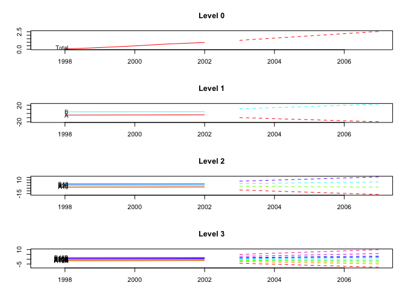
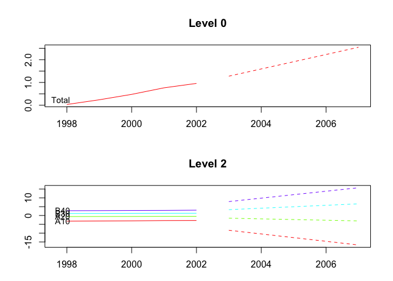
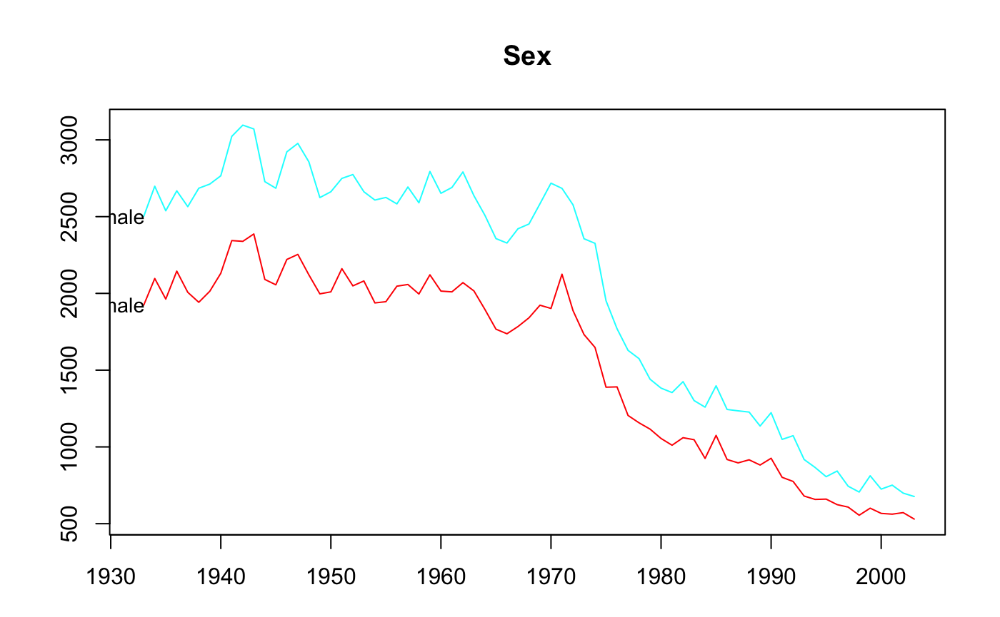
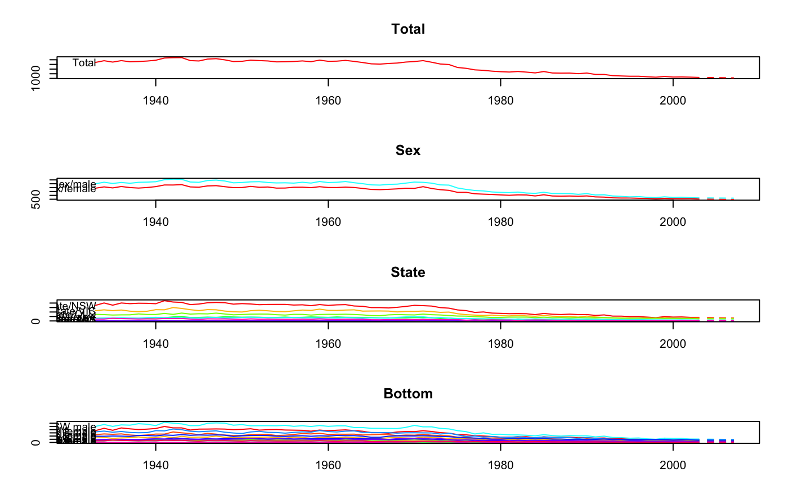
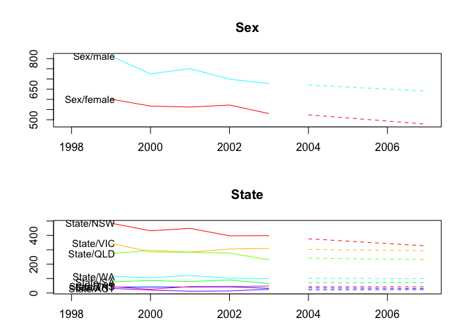

<!-- README.md is generated from README.Rmd. Please edit that file -->

# hts 

[](https://github.com/earowang/hts/actions?workflow=R-CMD-check)
[](https://cran.r-project.org/package=hts)
[](https://cran.r-project.org/package=hts)
[](https://www.tidyverse.org/lifecycle/#retired)

**hts** is retired, with minimum maintenance to keep it on CRAN. We
recommend using the [fable](http://fable.tidyverts.org) package instead.

The R package *hts* presents functions to create, plot and forecast
hierarchical and grouped time series.

## Installation

You can install the **stable** version on [R
CRAN](https://cran.r-project.org/package=hts).

``` r
install.packages('hts', dependencies = TRUE)
```

You can also install the **development** version from
[Github](https://github.com/robjhyndman/gts)

``` r
# install.packages("devtools")
devtools::install_github("earowang/hts")
```

## Usage

### Example 1: hierarchical time series

``` r
library(hts)
#> Loading required package: forecast
#> Registered S3 method overwritten by 'quantmod':
#>   method            from
#>   as.zoo.data.frame zoo

# hts example 1
print(htseg1)
#> Hierarchical Time Series 
#> 3 Levels 
#> Number of nodes at each level: 1 2 5 
#> Total number of series: 8 
#> Number of observations per series: 10 
#> Top level series: 
#> Time Series:
#> Start = 1992 
#> End = 2001 
#> Frequency = 1 
#>  [1] 48.74808 49.48047 49.93238 50.24070 50.60846 50.84851 51.70922 51.94330
#>  [9] 52.57796 53.21496
summary(htseg1)
#> Hierarchical Time Series 
#> 3 Levels 
#> Number of nodes at each level: 1 2 5 
#> Total number of series: 8 
#> Number of observations per series: 10 
#> Top level series: 
#> Time Series:
#> Start = 1992 
#> End = 2001 
#> Frequency = 1 
#>  [1] 48.74808 49.48047 49.93238 50.24070 50.60846 50.84851 51.70922 51.94330
#>  [9] 52.57796 53.21496
#> 
#> Labels: 
#> [1] "Level 0" "Level 1" "Level 2"
aggts1 <- aggts(htseg1)
aggts2 <- aggts(htseg1, levels = 1)
aggts3 <- aggts(htseg1, levels = c(0, 2))
plot(htseg1, levels = 1)
```

<!-- -->

``` r
smatrix(htseg1)  # Return the dense mode
#>      [,1] [,2] [,3] [,4] [,5]
#> [1,]    1    1    1    1    1
#> [2,]    1    1    1    0    0
#> [3,]    0    0    0    1    1
#> [4,]    1    0    0    0    0
#> [5,]    0    1    0    0    0
#> [6,]    0    0    1    0    0
#> [7,]    0    0    0    1    0
#> [8,]    0    0    0    0    1

# Forecasts
fcasts1.bu <- forecast(
  htseg1, h = 4, method = "bu", fmethod = "ets", parallel = TRUE
)
aggts4 <- aggts(fcasts1.bu)
summary(fcasts1.bu)
#> Hierarchical Time Series 
#> 3 Levels 
#> Number of nodes at each level: 1 2 5 
#> Total number of series: 8 
#> Number of observations in each historical series: 10 
#> Number of forecasts per series: 4 
#> Top level series of forecasts: 
#> Time Series:
#> Start = 2002 
#> End = 2005 
#> Frequency = 1 
#> [1] 53.2149 53.2149 53.2149 53.2149
#> 
#> Method: Bottom-up forecasts 
#> Forecast method: ETS
fcasts1.td <- forecast(
  htseg1, h = 4, method = "tdfp", fmethod = "arima", keep.fitted = TRUE
)
summary(fcasts1.td)  # When keep.fitted = TRUE, return in-sample accuracy
#> Hierarchical Time Series 
#> 3 Levels 
#> Number of nodes at each level: 1 2 5 
#> Total number of series: 8 
#> Number of observations in each historical series: 10 
#> Number of forecasts per series: 4 
#> Top level series of forecasts: 
#> Time Series:
#> Start = 2002 
#> End = 2005 
#> Frequency = 1 
#> [1] 53.71128 54.20760 54.70392 55.20024
#> 
#> Method: Top-down forecasts using forecasts proportions 
#> Forecast method: Arima 
#> In-sample error measures at the bottom level: 
#>                AA           AB          AC          BA           BB
#> ME   0.0007719336 0.0009183738 0.001003812 0.001043247  0.001087807
#> RMSE 0.1298400018 0.0515879830 0.040306867 0.037462277  0.105015065
#> MAE  0.0978321731 0.0436089571 0.033210387 0.027003846  0.081906948
#> MAPE 1.1275970221 0.4534439625 0.323535559 0.251066115  0.691364891
#> MPE  0.0367879336 0.0069220593 0.006785872 0.007787895 -0.011087494
#> MASE 0.6825678136 0.5197483057 0.774250880 0.447950006  0.493684443
fcasts1.comb <- forecast(
  htseg1, h = 4, method = "comb", fmethod = "ets", keep.fitted = TRUE
)
aggts4 <- aggts(fcasts1.comb)
plot(fcasts1.comb, levels = 2)
```

<!-- -->

``` r
plot(fcasts1.comb, include = 5, levels = c(1, 2))
```

<!-- -->

### Example 2: hierarchical time series

``` r
# hts example 2
data <- window(htseg2, start = 1992, end = 2002)
test <- window(htseg2, start = 2003)
fcasts2.mo <- forecast(
  data, h = 5, method = "mo", fmethod = "ets", level = 1,
  keep.fitted = TRUE, keep.resid = TRUE
)
accuracy.gts(fcasts2.mo, test)
#>           Total          A          B        A10          A20         B30
#> ME   -0.1463168 -0.2229191 0.07660233 -0.2283919  0.005472780 -0.01989880
#> RMSE  0.1500119  0.2452066 0.14257606  0.2523329  0.009805797  0.02928379
#> MAE   0.1463168  0.2229191 0.11693106  0.2283919  0.009268225  0.02409282
#> MAPE  9.3179712  7.5314777 2.36244104  8.7993966  2.460560011  1.71428541
#> MPE  -9.3179712  7.5314777 1.45433283  8.7993966 -1.631079601 -1.39920296
#> MASE  0.4617075  1.2506962 0.84324674  1.5148807  0.337389275  0.52860991
#>             B40        A10A       A10B          A10C         A20A         A20B
#> ME   0.09650113 -0.05448806 -0.1733829 -0.0005209908  0.007965591 -0.002492811
#> RMSE 0.17060895  0.06809235  0.1867174  0.0100661166  0.012682474  0.008654148
#> MAE  0.14102388  0.05448806  0.1733829  0.0088897199  0.010413971  0.007052515
#> MAPE 3.98260313  4.37476593 21.6158413  1.5612291069  3.334410408 13.402921842
#> MPE  2.54768302  4.37476593 21.6158413  0.0605205225 -2.607467068 -2.981389244
#> MASE 1.51492018  0.51577051  5.3650162  0.6942763126  0.820393749  0.477277465
#>            B30A        B30B        B30C        B40A      B40B
#> ME   0.01212900 -0.01099794 -0.02102986 -0.04273559 0.1392367
#> RMSE 0.01311771  0.01422607  0.02442915  0.06656885 0.2344656
#> MAE  0.01212900  0.01099794  0.02102986  0.04273559 0.1811449
#> MAPE 4.13200908  2.39939647  3.26532975  3.09570196 8.2253477
#> MPE  4.13200908 -2.39939647 -3.26532975 -3.09570196 5.9207223
#> MASE 0.49670326  1.22312029  1.72843722  0.82335272 4.3982548
accuracy.gts(fcasts2.mo, test, levels = 1)
#>               A          B
#> ME   -0.2229191 0.07660233
#> RMSE  0.2452066 0.14257606
#> MAE   0.2229191 0.11693106
#> MAPE  7.5314777 2.36244104
#> MPE   7.5314777 1.45433283
#> MASE  1.2506962 0.84324674
fcasts2.td <- forecast(
  data, h = 5, method = "tdgsa", fmethod = "ets", 
  keep.fitted = TRUE, keep.resid = TRUE
)
plot(fcasts2.td, include = 5)
```

<!-- -->

``` r
plot(fcasts2.td, include = 5, levels = c(0, 2))
```

<!-- -->

### Example 3: grouped time series

``` r
# gts example
plot(infantgts, levels = 1)
```

<!-- -->

``` r

fcasts3.comb <- forecast(infantgts, h = 4, method = "comb", fmethod = "ets")
agg_gts1 <- aggts(fcasts3.comb, levels = 1)
agg_gts2 <- aggts(fcasts3.comb, levels = 1, forecasts = FALSE)
plot(fcasts3.comb)
```

<!-- -->

``` r
plot(fcasts3.comb, include = 5, levels = c(1, 2))
```

<!-- -->

``` r

fcasts3.combsd <- forecast(
  infantgts, h = 4, method = "comb", fmethod = "ets",
  weights = "sd", keep.fitted = TRUE
)

fcasts3.combn <- forecast(
  infantgts, h = 4, method = "comb", fmethod = "ets",
  weights = "nseries", keep.resid = TRUE
)
```

## License

This package is free and open source software, licensed under GPL (\>=
2).
